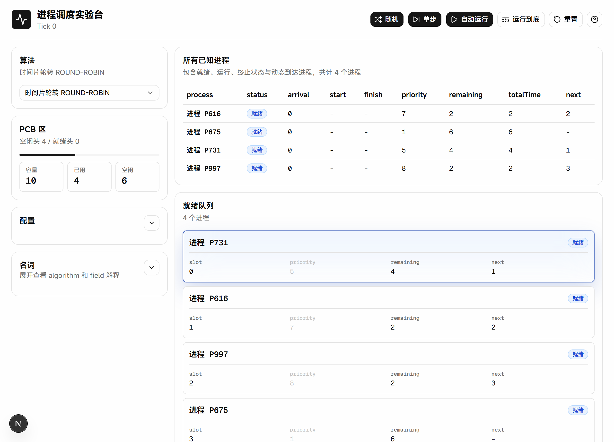
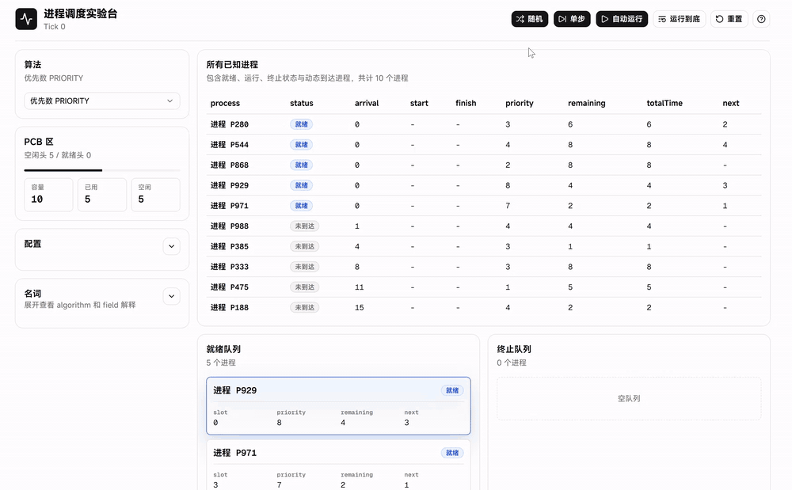

# 进程调度实验台

这是华南农业大学24届《操作系统》综合实验题目四的具体实现仓库。题目在[这里](./wiki/requirement)。



## 快速开始

### 一、下载可执行文件

免安装，免配置，快速上手的首选。

前往 [Releases](https://github.com/Here-Tim2354/process-scheduler/releases) 下载：

| 文件 | 适用环境 |
| --- | --- |
| `process-scheduler-0.1.0-win-x64-portable.exe` | Windows 10 / 11，64 位系统 |
| `process-scheduler-0.1.0-win-ia32-portable.exe` | Windows 10 / 11，32 位系统 |

本项目只分发 portable 版本。下载后双击运行，不需要安装。

不支持 Windows 7 / 8 / 8.1。当前 Electron 主线已经移除这些系统的支持，继续兼容会牺牲 Chromium 安全更新。

### 二、从源码构建

源码构建适合需要修改代码、检查算法实现，或重新打包可执行文件的场景。

环境要求：

- Node.js 20 及以上。

```bash
git clone https://github.com/Here-Tim2354/process-scheduler.git
cd process-scheduler
npm install
npm run dev
```

默认访问：
```txt
http://localhost:3000
```

如果端口被占用，可以手动指定端口：

```bash
npm run dev -- --hostname 127.0.0.1 --port your_port
```

Windows 下也可以运行根目录的 `start.bat`。这个脚本只是帮你启动本地服务。效果等价于
```
npm install
npm run dev
```


## 实现

本项目采用现代开发技术栈：

- Next.js / React / TypeScript
- Zustand
- React Hook Form / Zod
- Tailwind CSS / shadcn-ui / Base UI / lucide-react
- motion / Recharts
- Vitest / Playwright / Electron

## 特色

支持：

1. 自由度较高的配置面板。支持 PCB 容量、初始进程数、优先数范围、运行时间范围、进程出现概率和随机种子配置。
2. 拥有统计图表和日志追踪进程调度过程 
3. 可单步、自动运行、暂停、一键结束一轮调度。十分灵活。
4. 详细的专有名词解释栏目。部分表格内的专有名词支持鼠标悬停时展示解释。
5. 采用现代开发技术栈，使用`motion`动画库实现不错的 UI 过渡效果。




## 算法

- 时间片轮转：队首运行一个时间片，未结束则回到队尾。
- 优先数调度：大数优先，每运行一次优先数和剩余时间各减 1。
- 最短进程优先：非抢占，选中后直接运行到结束。
- 最短剩余时间优先：按剩余时间排序，每次运行一个时间片。

## 项目结构

```txt
src/
  app/                   页面入口
  components/scheduler/  调度实验台 UI
  components/ui/         shadcn/ui 组件
  lib/scheduler/         调度核心逻辑
  stores/                Zustand 状态连接层
scripts/
  smoke.mjs              页面 smoke 验证
wiki/
  requirement/           课程题目与要求
```

## 构建分发

本仓库按 GitHub Release 分发可执行文件。源码仓库只保存代码、文档和演示素材；`dist/`、`out/`、`.next/` 这类构建产物不进入 Git。

构建 Windows portable：

```bash
npm run dist
```

这条命令会先执行 Electron 目标的 Next.js 构建，再通过 `electron-builder` 生成两个文件：

```txt
dist/process-scheduler-0.1.0-win-x64-portable.exe
dist/process-scheduler-0.1.0-win-ia32-portable.exe
```

Release 上传时同时附带 SHA256 校验文件，方便确认下载文件没有损坏。

## 许可证

MIT
