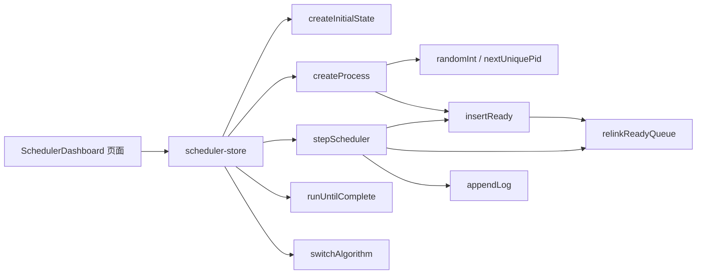

# 《操作系统分析与设计实习》课程设计报告

## 成绩单

| 项目 | 内容 |
| --- | --- |
| 班级 | 待填写 |
| 学号 | 待填写 |
| 姓名 | 待填写 |
| 题目 | 题目四：单处理器系统的进程调度 |
| 指导教师 | 待填写 |
| 提交日期 | 待填写 |

---

# 单处理器系统的进程调度

> 班级、学号、姓名、提交日期等信息待填写。截图可使用 `.next/qa-desktop.png` 和 `.next/qa-mobile.png` 作为运行结果素材。

## 1. 需求分析

本程序模拟单处理器系统中的进程调度。程序不操作真实操作系统 PCB，而是在 Web 页面中维护一组虚拟 PCB，并通过调度算法改变 PCB 的状态和队列关系。

输入包括 PCB 容量、初始进程数量、优先数范围、运行时间范围、动态到达概率、随机种子和调度算法。输出包括本次运行进程、就绪队列、终止队列、PCB 区使用情况、调度日志、调度时间线、等待时间和周转时间统计。

程序实现四种算法：

1. 时间片轮转调度。
2. 优先数调度。
3. 最短进程优先。
4. 最短剩余时间优先。

边界输入通过表单校验处理，例如初始进程数不能超过 PCB 容量，运行时间下限不能大于上限。PCB 区满时，页面提示“PCB 区已满”。

## 2. 概要设计

核心模块位于 `src/lib/scheduler`。页面组件位于 `src/components/scheduler`。状态连接层位于 `src/stores/scheduler-store.ts`。

主要数据结构：

- `Pcb`：记录槽位、进程标识符、状态、优先数、剩余运行时间、总运行时间、next 指针、到达时间、开始时间和结束时间。
- `pcbArea`：数组模拟有限 PCB 区。
- `freeQueue`：空闲 PCB 槽位队列。
- `readyQueue`：就绪队列，保存 PCB 槽位下标。
- `terminatedQueue`：终止队列，保存已结束进程的 PCB 槽位下标。
- `run`：最近一次被调度运行的 PCB 槽位。
- `logs`：调度日志。
- `timeline`：处理器占用时间线。

主流程：

1. 初始化配置和 PCB 区。
2. 按随机种子创建初始进程。
3. 用户选择算法并进行单步、自动运行或运行到底。
4. 调度核心取出就绪队列队首或按算法排序后的首进程。
5. 更新剩余时间、优先数、状态和队列。
6. 页面展示当前状态和统计结果。

函数调用关系图：



## 3. 详细设计

### 3.1 进程创建原语

伪码：

```txt
createProcess(state):
  if freeQueue 为空:
    error = "PCB 区已满"
    return state

  slot = freeQueue.head
  pid = 根据随机种子生成唯一 PID
  priority = 在配置范围内随机生成
  time = 在配置范围内随机生成

  pcbArea[slot] = 新 PCB
  freeQueue 弹出 slot
  readyQueue 按当前算法插入 slot
  更新 ready head/tail 和 freePointer
```

### 3.2 进程调度原语

伪码：

```txt
stepScheduler(state):
  如果启用动态到达:
    按动态到达概率尝试创建新进程

  if readyQueue 为空:
    写入空队列日志
    return state

  slot = readyQueue.head
  process = pcbArea[slot]
  run = slot

  if algorithm 是 SPF:
    process.remainingTime = 0
    tick += 原剩余运行时间
    process.status = terminated
    加入 terminatedQueue
  else:
    process.remainingTime -= 1
    if algorithm 是 priority:
      process.priority -= 1

    tick += 1
    if process.remainingTime == 0:
      process.status = terminated
      加入 terminatedQueue
    else:
      process.status = ready
      按算法规则重新插入 readyQueue

  写入调度日志和时间线
```

### 3.3 四种算法规则

- 时间片轮转：保持 FIFO，未完成进程追加到队尾。
- 优先数调度：按优先数从大到小排序，运行后优先数减 1。
- 最短进程优先：按总运行时间从小到大排序，选中后一次运行至结束。
- 最短剩余时间优先：按剩余时间从小到大排序，每次只运行一个时间片。

## 4. 调试分析

调试重点：

1. PCB 容量达到上限时不能继续创建进程。
2. 已终止进程不能重新进入就绪队列。
3. 优先数调度运行后必须同时减少优先数和剩余时间。
4. SPF 必须保持非抢占，一次调度直接运行到结束。
5. SRTF 必须按剩余时间重新排序。
6. 页面状态必须与核心调度状态一致。

当前验证命令：

```txt
npm test      6 个核心调度单元测试通过
npm run lint 通过
npm run build 通过
npm run smoke 通过，能打开页面并执行单步、生成进程、运行到底
```

复杂度分析：

- 队列插入在优先数、SPF、SRTF 中使用排序，复杂度约为 `O(n log n)`。
- 时间片轮转队尾插入为 `O(1)` 到 `O(n)`，取决于数组复制成本。
- 单步调度主要受队列长度影响，适合本课程设计中的小规模 PCB 模拟。

## 5. 用户使用说明

1. 运行 `npm install` 安装依赖。
2. 运行 `npm run dev` 启动项目。
3. 打开浏览器访问 `http://localhost:3000`。
4. 在左侧选择调度算法。
5. 修改 PCB 容量、初始进程数、优先数范围、运行时间范围、动态概率和随机种子。
6. 点击“应用配置”重新生成初始进程。
7. 点击“生成进程”手动创建随机进程。
8. 点击“单步”执行一次调度。
9. 点击“自动运行”连续调度；再次点击可暂停。
10. 点击“运行到底”直接调度到就绪队列为空。
11. 通过“时间线 / PCB / 日志”查看运行结果。

Windows 下可直接运行项目根目录 `start.bat`。脚本会进入项目目录，如果尚未安装依赖则先执行 `npm install`，随后启动本地 Web 程序。

## 6. 测试与运行结果

已覆盖的自动化测试：

1. PCB 数量达到上限测试。
2. 时间片轮转队尾回队测试。
3. 优先数调度优先级与优先数递减测试。
4. 最短进程优先非抢占测试。
5. 最短剩余时间优先排序测试。
6. 运行直到全部进程终止测试。
7. 动态随机生成新进程测试。

可复现测试数据：

| 测试项 | 输入条件 | 预期结果 |
| --- | --- | --- |
| 时间片轮转 | P201 时间 2，P202 时间 1 | 第一次调度 P201 后，P201 回到队尾 |
| 优先数调度 | P301 优先数 2，P302 优先数 8 | 先调度 P302，运行后进入终止队列 |
| 最短进程优先 | P401 时间 5，P402 时间 2 | 先调度 P402，且一次运行到结束 |
| 最短剩余时间优先 | P501 时间 6，P502 时间 2，新到达 P503 时间 1 | 按剩余时间重新排序，短剩余时间优先 |
| PCB 上限 | 容量 2，连续创建 3 个进程 | 第 3 个进程创建失败并提示 PCB 区已满 |
| 动态到达 | 动态到达概率 100% | 单步调度前动态创建新进程 |

运行截图建议：

- 初始页面：展示 PCB 区、就绪队列和配置项。
- 单步调度后：展示本次运行进程、就绪队列变化和日志。
- 运行到底后：展示终止队列、调度时间线和统计图。
- 移动端页面：展示响应式纵向布局。
